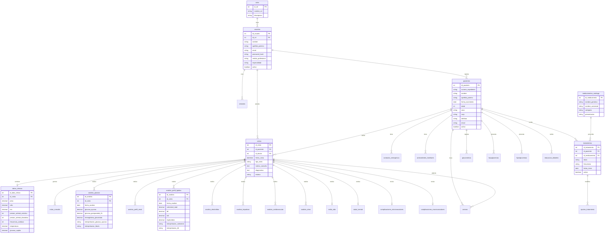

# Diagrama Entidad-Relación - Base de Datos Clínica de Diabetes

Este diagrama muestra la estructura completa de la base de datos y las relaciones entre las tablas.

## Diagrama Principal

## Módulos del Sistema

### 1. Módulo de Usuarios y Autenticación
- **roles**: Catálogo de roles (Admin, Doctor)
- **usuarios**: Doctores y administradores del sistema
- **sesiones**: Control de sesiones activas

### 2. Módulo de Pacientes
- **pacientes**: Información demográfica y personal
- **contactos_emergencia**: Contactos de emergencia
- **antecedentes_familiares**: Historial familiar de enfermedades

### 3. Módulo de Visitas y Consultas
- **visitas**: Registro de cada consulta médica
- **datos_clinicos**: Signos vitales (peso, PA, FC, etc.)
- **notas_consulta**: Notas y observaciones del doctor

### 4. Módulo de Análisis Clínicos
- **analisis_glucosa**: Glucosa, HbA1c
- **analisis_perfil_renal**: Creatinina, TFG, microalbuminuria
- **analisis_perfil_lipidico**: Colesterol, LDL, HDL, triglicéridos
- **analisis_electrolitos**: Na, K, Cl, Ca, P, Mg
- **analisis_hepaticos**: ALT, AST, bilirrubinas
- **analisis_cardiovascular**: Troponina, BNP
- **analisis_otros**: Vitamina D, TSH, hemograma

### 5. Módulo de Medicamentos
- **medicamentos_catalogo**: Catálogo de medicamentos
- **tratamientos**: Medicamentos prescritos al paciente
- **ajustes_tratamiento**: Historial de cambios de dosis

### 6. Módulo de Estilo de Vida
- **estilo_vida**: Alimentación, ejercicio, tabaquismo
- **educacion_diabetes**: Educación diabetológica recibida

### 7. Módulo de Complicaciones
- **complicaciones_microvasculares**: Neuropatía, retinopatía, nefropatía
- **complicaciones_macrovasculares**: Enfermedad coronaria, ACV

### 8. Módulo de Control y Seguimiento
- **glucometrias**: Bitácora diaria de glucosa
- **hipoglucemias**: Eventos de hipoglucemia
- **hiperglucemias**: Eventos de hiperglucemia

### 9. Módulo de Salud Mental
- **salud_mental**: Estado de ánimo, ansiedad, depresión

### 10. Módulo de Anexos
- **anexos**: Archivos adjuntos (PDFs, imágenes, estudios)

### 11. Módulo de Configuración
- **rangos_referencia**: Valores normales para cada parámetro
- **interpretaciones**: Reglas de interpretación automática

## Relaciones Principales

### Paciente → Visitas → Análisis
Un paciente tiene múltiples visitas, y cada visita puede tener múltiples análisis clínicos.

### Visita → Datos Clínicos
Cada visita tiene un único registro de signos vitales (relación 1:1).

### Paciente → Tratamientos → Medicamentos
Un paciente puede tener múltiples tratamientos activos, cada uno vinculado a un medicamento del catálogo.

### Usuario → Visitas
Un doctor (usuario) atiende múltiples visitas.

## Características Especiales

### Triggers Automáticos
- **Cálculo de IMC**: Se calcula automáticamente al insertar/actualizar peso y talla
- **Cálculo de Edad**: Se calcula automáticamente desde la fecha de nacimiento

### Interpretación Automática
Cada análisis clínico tiene campos de interpretación (Normal, Precaución, Alerta) que se pueden calcular automáticamente comparando con los rangos de referencia.

### Auditoría
Todas las tablas principales incluyen:
- `created_at`: Fecha de creación
- `updated_at`: Fecha de última modificación
- `created_by`: Usuario que creó el registro

### Soft Deletes
Los pacientes y usuarios tienen un campo `activo` para desactivación lógica en lugar de eliminación física.
